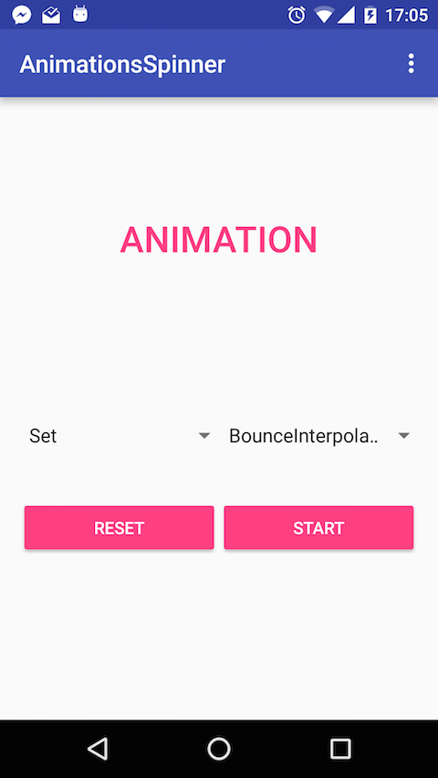
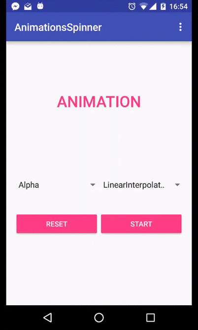
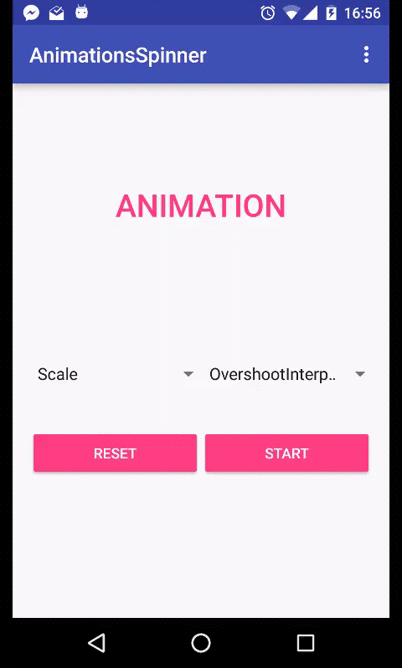
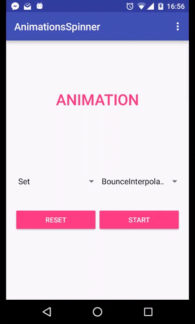
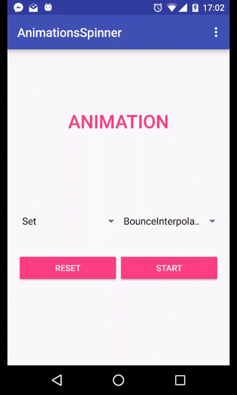

## Objectives
* Attracts users by using animations.

## Requirements
### Activity Transitions:
* Add slide up/slide down for [Exercise 1.1](Exercise_1_1_Layout_and_UI_controls.md) when user leaves/enters each signup step.

### Fragment Transitions:
* Do the same thing with `Activity Transitions` but for Fragment from [Exercise 3.1](Exercise 3_1_Fragment.md)

### View Animations and layout animations:
*  Implements an app with UI like this:

* There are 2 spinners inside the app that contains:

    Type of animations | Type of interpolator
    :----------------- | -------------------:
    Alpha              | LinearInterpolator  
    SlideUp            | AccelerateInterpolator
    SlideDown          | AnticipateInterpolator
    Rotation           | OvershootInterpolator
    Scale              | BounceInterpolator
    Set                |

* The type of interpolator is the name of interpolator class that Android already supports
* Press `START` will animate all the views above the spinners with the selected animation and interpolator.
* See the below gifs for animation types:

    

    Alpha animation

    

    Slide animation

    

    Rotate animation

    

    Scale animation

    

    Set animation

### Layout animations
* The above application also contains a menu that can `add` and `remove` view inside the view group above 2 spinners.
* When add/remove view out of the view group, there will be animations described as below:

## References:
* [Guide to implement animations](https://github.com/codepath/android_guides/wiki/Animations)
* [Android guide of animations](http://developer.android.com/guide/topics/graphics/prop-animation.html)
